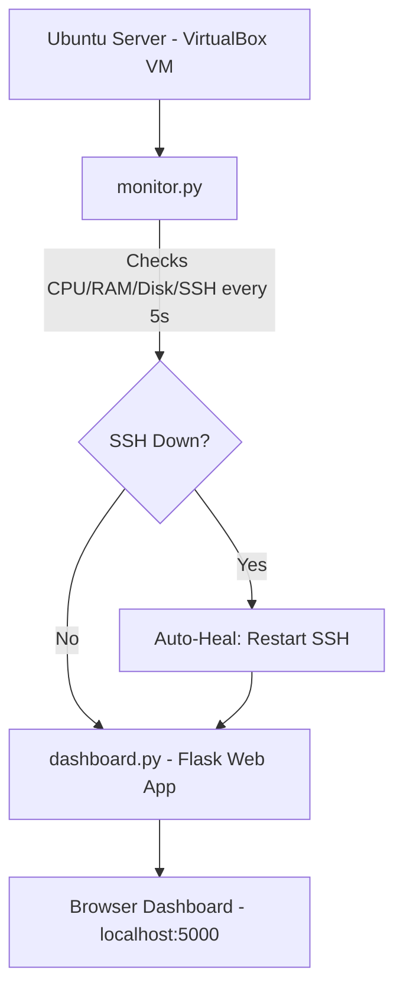
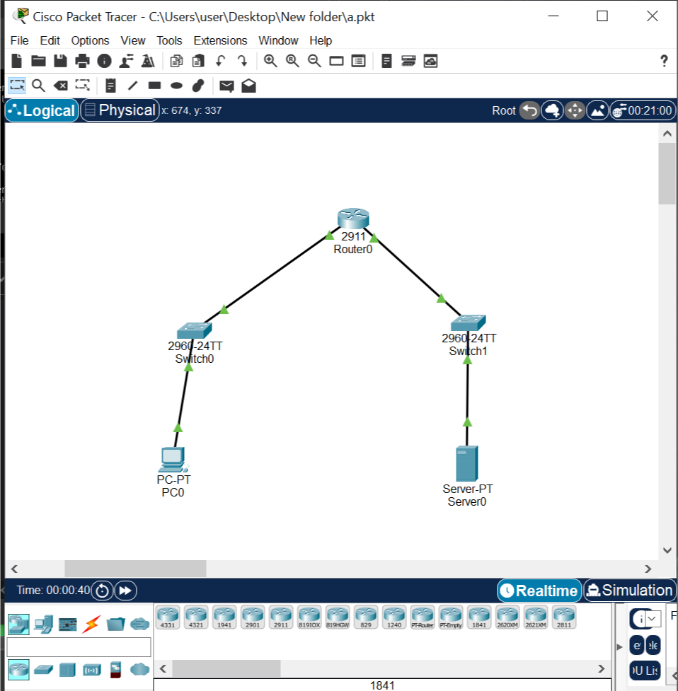

# Network Automation & Monitoring Toolkit

A self-hosted monitoring system that tracks server health (CPU, RAM, Disk, SSH service status) in real time, automatically detects and recovers from service failures, and deploys itself using Infrastructure-as-Code principles.

## 🎯 Project Overview

This project simulates a real-world server monitoring and auto-healing setup, built as part of my networking internship preparation. It demonstrates practical skills in Linux administration, Python scripting, automation, and DevOps tooling.

## 🏗️ Architecture


Deployment is automated with **Ansible** (`deploy_dashboard.yml`), which installs dependencies, sets up a Python virtual environment, and registers the dashboard as a `systemd` service — so it runs permanently and restarts automatically on boot.

## 🛠️ Tech Stack

- **Linux** (Ubuntu Server 24.04) — core environment
- **Python 3** (`psutil`, `subprocess`) — system monitoring logic
- **Flask** — web dashboard
- **Ansible** — automated deployment (Infrastructure as Code)
- **systemd** — service management / auto-restart on boot
- **Git/GitHub** — version control

## ✨ Features

- Real-time CPU, RAM, and Disk usage monitoring
- SSH service health check every 5 seconds
- **Automatic recovery** — detects a down service and restarts it without manual intervention
- Web dashboard with color-coded status (green = active, red = inactive)
- One-command deployment via Ansible playbook
- Runs as a persistent background service (`systemd`)

## 🚀 How to Run

```bash
# Clone the repo
git clone https://github.com/chathurikamadhuwanthi/Network-Automation-Toolkit.git
cd Network-Automation-Toolkit

# Option 1: Run manually
python3 -m venv venv
source venv/bin/activate
pip install flask psutil
python3 dashboard.py

# Option 2: Deploy with Ansible (recommended)
cd ansible
ansible-playbook deploy_dashboard.yml --ask-become-pass
```

Then visit `http://localhost:5000` in your browser.

## 📸 Demo

The dashboard shows live system stats and SSH service status. When the SSH service is stopped manually, the monitoring script detects the failure within 5 seconds and automatically restarts it — the dashboard updates from red (INACTIVE) back to green (ACTIVE) without any manual action.

## 📚 What I Learned

- Setting up and configuring a Linux server from scratch in a virtualized environment
- Writing Python scripts to interact with system services via `subprocess` and `psutil`
- Building a lightweight Flask web application
- Automating deployment using Ansible playbooks and troubleshooting YAML syntax/permission issues
- Managing services with `systemd`
- Using Git/GitHub for version control, including SSH key authentication

## 🌐 Bonus: Network Topology Design

As part of this project, I also designed and configured a basic network topology in Cisco Packet Tracer to practice routing and connectivity fundamentals.



- Router (2911) connecting two switches
- Configured static IP addressing and routing between subnets
- Verified end-to-end connectivity (PC0 ↔ Server0)
  
## 🔮 Future Improvements

- Add more services to monitor (web server, database, etc.)
- Email/Slack notifications on service failure
- Historical data logging and graphing
- Multi-server support with a centralized dashboard

---
**Author:** Chathurika Madhuwanthi | Networking Student at University of sri jayewardenepura 
